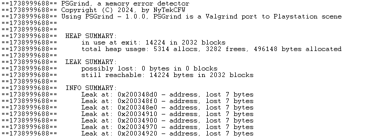
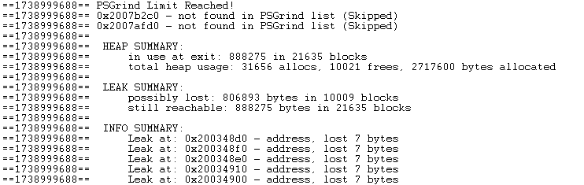
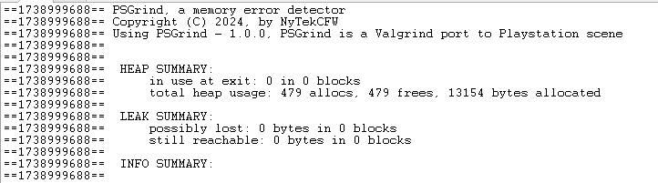

# PSGrind
PSGrind a port of valgrind on Playstation scene


## About
PSGrind is just a way to know if you have memory leaks on your playstation projects (Sprx / homebrew ...).   
Note : This project was developed with the libsvsc.a library (a private library) that include each thing requiered to work properly, so some include can be requiered.  


## How it work
PSGrind work by overriding new and delete operator, for the moment it work only on Playstation 3 but will be port on Playstation 4 soon.  
PSGrind will register each alloc and his size and will remove the correct allocated memory from his list when a delete is called.  
To work properly you need to call 'void	print_psgrind(bool print_leak_info, bool kill);' in your exit function preferably when your project is 100% unloaded like :  
```cpp
int  _exit(void)
{
  ....//unload your mod data and alloc
  //method to show result and not kill psgrind directly
  print_psgrind(false, false);
  printf("Unloaded\n");
  kill_psgrind();
  //or
  print_psgrind(false, true);
}
```
You can do a max of 12 000 allocated memory in simultaneously.  
Also each statement of PSGrind is printed with a printf so you need a way to see logs of your console like ProDG or any other logs viewer.  


## Memory Leaks
### Massive Memory leaks (Possibly lost)
When you have more than 12 000 allocated memory in same time, PSGrind will stop registering allocated memory and will increase the 'Possibly lost count' that means the allocated memory is probably totaly lost and not removed from memory.  
A way to know if you reached the limit is to see the logs viewer normaly PSGrind will print 'PSGrind Limit Reached!'
A restart of the Playstation or a restart of the game is recommended at this time, to remove each memory block lost.  

### Minor Memory Leaks (still reachable)
When you have memory leaks as long as there is no more than 12,000 memory allocated at the same time, each "still reachable" will be automatically deleted by PSGrind when the kill function is called, so you have no risk of crash caused by too many of memory allocated not removed.  


## Logs info
### ==(1203214 or any other digit)== :
Id of PSGrind if it change when you reload your sprx without restarting game / playstation, you have probably a massive leak or you tried to load in same time 2 sprx.  

### in use at exit : 
Displayed how many bytes and number of allocated memory  not removed.  

### total heap usage:
Tell you the number of block allocated and free, and bytes allocated since the start of PSGrind  

### possibly lost:
Tell you the number of allocated memory and size possibly lost  

### still reachable
Tell you the number of allocated memory and size not removed  

### Rerun with print_leak_info = true to see details of leaked memory
print_psgrind(true, ...); show you the address (of allocated memory) and the size allocated but not removed.  

### Leak at:
Show the address (of allocated memory) and the size allocated but not removed.  


## Showcase
<div align="center">
  

  

  
</div>
